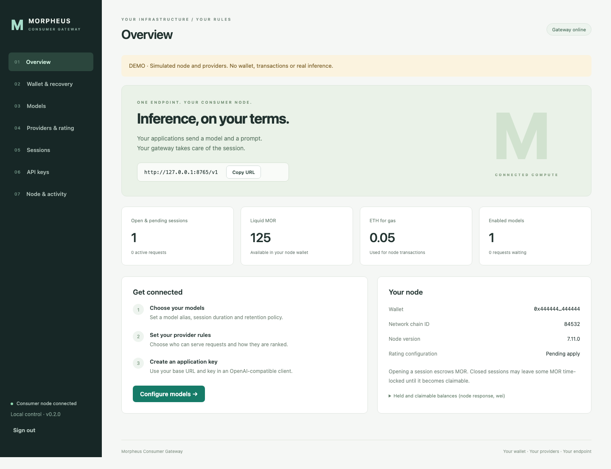

# Morpheus Consumer Gateway

Run your own Morpheus API endpoint beside your consumer node. Give an application your URL and an API key, choose a model, and send a prompt. The gateway opens or reuses a permitted provider session and sends inference through your node.

The browser dashboard has ordinary fields and buttons for model selection, session duration, provider allowlists/blocklists, rating weights, API keys, and node restarts. Nothing to install on the computer using the dashboard.

**Production status: NO-GO.** The September 13–14, 2026 campaign exercised real funded sessions, crashes, cleanup, browsers and load. It found unresolved release blockers, including a cold-start concurrency hang. Read the [full testing report](docs/PRODUCTION-READINESS-REPORT.md), [scenario matrix](docs/PRODUCTION-TEST-MATRIX.md) and [reproductions](audits/production_readiness/README.md) before relying on this build for unattended use.



## What it does

- Serves `GET /v1/models` and `POST /v1/chat/completions`, including streaming.
- Issues revocable application API keys with model scopes, request rates, and concurrency limits.
- Lets you choose model aliases and session lengths from 5 minutes to 24 hours, subject to network acceptance.
- Opens sessions on demand, closes idle sessions, retains them until expiry, or keeps replacing them while a model is configured to stay available.
- Enforces provider access before opening and before dispatch, including on reused sessions. A blocklist entry wins over an allowlist entry; a strict empty allowlist permits nobody.
- Edits the node's five rating weights and applies its rating JSON with a controlled local node restart.
- Drains active requests before a normal restart, offers an explicit immediate restart, and reports operation status while the dashboard stays available.
- Persists configuration, hashed API keys, session ownership, and uncertain operations in SQLite.
- Cleans up dead/expired sessions, reconciles interrupted transactions, cools down failed providers, and withdraws eligible MOR after contract locks expire.
- Exposes wallet recovery, stake/price/reserve limits, paginated history and request outcomes in the dashboard.

See [recovery behavior and audit fixes](docs/RECOVERY-AND-AUDIT-FIXES.md) for defaults, guarantees and remaining limits.

“Keep available” maintains an open marketplace session when capacity, funds, and providers permit. It does not reserve GPU memory, extend an existing on-chain session, or guarantee uninterrupted availability. Opening a session escrows MOR; it is not the same as buying tokens from a centralized API.

## Run on a Linux VM

Use a VM with Docker Engine and the Compose plugin, outbound access to your RPC and providers, a consumer wallet, MOR for session escrow, and native gas funds on the selected network. No GPU is needed on the consumer VM. Use one dedicated consumer node/wallet for this installation.

```sh
git clone https://github.com/bowtiedbluefin/morpheus-consumer-gateway.git
cd morpheus-consumer-gateway
cp .env.example .env
python3 scripts/setup.py
```

The setup script asks for the wallet private key with hidden input. It creates three local files under `secrets/`, never overwrites existing secrets, and never prints their values. Keep these files private and out of source control.

Edit `.env` with your domain, matching `PUBLIC_ORIGIN`, RPC URL, and network. Base mainnet is the default (`8453`); use `84532` with a matching Base Sepolia RPC for a test installation. Contract addresses remain the pinned node's responsibility. Verify them against the node's documentation for your network.

Containers run as UID/GID **10001**. On Linux, grant that container group read access to the secret files; keep the containing directory private:

```sh
sudo chgrp 10001 secrets/admin-token secrets/node-password secrets/wallet-key
chmod 640 secrets/admin-token secrets/node-password secrets/wallet-key
chmod 700 secrets
```

Point the domain's DNS at the VM and permit inbound TCP 80/443 for the HTTPS ingress. Then:

```sh
docker compose --profile https up -d --build
docker compose logs --tail 100 node gateway
```

Visit `https://YOUR-DOMAIN/`. Read `secrets/admin-token` locally and use it in the **Administrator secret** field. It is a dashboard credential; issue a separate application API key from **API keys**.

In **Models**, browse the node catalog, add an on-chain model, set its alias and session duration, and save. In **Providers & rating**, set provider restrictions and weights. **Save settings** enforces gateway access immediately; **Apply rating and restart** also writes the native node's rating configuration and loads it by restarting the node. Expanding a previously restrictive node allowlist may require that restart before the node returns the newly permitted bids.

Only port 8000 on loopback is published by the gateway; the node's administrative port 8082 is internal. The optional Caddy service exposes the web dashboard and inference API over HTTPS. The supervisor's control socket is local to the two containers. No Docker socket is mounted.

For local HTTP, set `PUBLIC_ORIGIN=http://localhost:8000` and `COOKIE_SECURE=false` in `.env`, then run `docker compose up -d --build` and open that exact URL. For remote HTTP development, use an SSH tunnel to this loopback port. Browser-origin checking requires the URL to match exactly.

## Send a prompt

Copy a newly created application key into your application's secret storage and set its API base URL to `https://YOUR-DOMAIN/v1`. For example, with `MORPHEUS_API_KEY` already set in your shell:

```sh
curl https://YOUR-DOMAIN/v1/chat/completions \
  -H "Authorization: Bearer $MORPHEUS_API_KEY" \
  -H 'Content-Type: application/json' \
  -d '{"model":"your-model-alias","messages":[{"role":"user","content":"Hello"}]}'
```

Add `"stream":true` and use `curl -N` for streaming. Send the complete message history each time; node chat-context persistence and forwarding are disabled for this deployment. The first request may need provider negotiation and an on-chain transaction. Give your client a timeout that allows cold session creation (for example, five minutes). Send an `Idempotency-Key` header to reject repeated attempts (409); responses are not stored or replayed. Allow up to six minutes for a cold request, including opening and inference.

The gateway tries up to three distinct eligible providers only when the pinned node explicitly reports a failure proven to occur **before** on-chain opening. An ambiguous opening stops further opens until reconciled. It does not automatically replay a prompt or switch providers after inference begins. The upstream node has its own transport behavior.

This release supports chat completions and model listing. It does not implement the Responses API, embeddings, audio, billing, or every hosted Morpheus API endpoint. Provider-specific chat capabilities depend on the chosen model.

## Try the dashboard without a wallet

Requires Python 3.13 and Node.js 22. This mode uses a visibly labeled simulated provider and simulated restart helper; no blockchain transactions occur.

```sh
python3.13 -m venv .venv
.venv/bin/pip install -r requirements-dev.lock
.venv/bin/pip install --no-deps -e .
npm --prefix web ci
npm --prefix web run build
export ADMIN_TOKEN="$(.venv/bin/python -c 'import secrets; print(secrets.token_urlsafe(48))')"
export DATA_DIR="$(mktemp -d)"
export PUBLIC_ORIGIN=http://localhost:8000
.venv/bin/python -m uvicorn devtools.demo:create_app --factory --host 127.0.0.1 --port 8000 --no-access-log
```

Sign in using the generated `ADMIN_TOKEN` from your shell. Use a fresh temporary `DATA_DIR` when starting a new demo; simulated on-chain sessions exist only for that process lifetime. Choose **Demo model** from the catalog. The production application factory never silently falls back to this demo.

## How it is packaged

| Component | Responsibility |
| --- | --- |
| `gateway/` | FastAPI server, authentication, policy, SQLite state, session manager, inference forwarding |
| `web/` | React/TypeScript dashboard, built into static assets served by the gateway |
| `node_helper/` | Local Unix-socket service that owns the node subprocess and writes a fixed rating file |
| Existing Morpheus node | Provider handshake, wallet, transactions, native rating and inference protocol |
| `compose.yaml` | Two application containers, persistent volumes, optional HTTPS ingress |

A dashboard restart request becomes a tracked job. The gateway stops admitting requests and waits for current requests to finish. The helper atomically writes validated rating JSON, stops its own node child, starts it, and checks the node API. If startup fails after a configuration change, it restores the previous file and attempts to restart with it. The gateway then checks wallet/network identity and reconciles its sessions before resuming admission. A drain timeout aborts the restart. Immediate restart can interrupt active requests.

The node is built from pinned **v7.11.0** source with the reviewed stake/journal/serialization patch in `deploy/`, and the gateway rejects other versions until the adapter is verified. Runtime Python dependencies and frontend dependencies have lockfiles. The original node MIT notice is included in the node image. API and Electron source were reviewed for orchestration patterns and behavior; their applications are not bundled or forked into this service.

## Operational limits

- One gateway worker and one node per installation. SQLite plus a process lock prevents two workers sharing the same data directory. Separate data directories do not coordinate the same wallet.
- Gateway lifecycle operations and native approval/open/close/withdraw sequences are serialized. In bundled mode, the gateway owns expiry cleanup; the native expiry worker only rehydrates session state. Other machines or external wallet writers are not coordinated.
- Per-session stake is capped by the patched node. Total managed-plus-held stake, provider price and liquid/gas reserves are checked before opening. External live sessions and actual gas costs are not covered by a wallet-wide hard cap.
- Application keys share the installation's sessions and wallet. This is a personal/team gateway, not tenant billing isolation. Rate counters reset on gateway restart.
- The node's private admin credential is held by the gateway. It is not exposed to the browser or application keys. The current native agent-auth mechanism is not a drop-in method-only restricted account for these operations.
- The dashboard manages its rating file, not arbitrary host files, shell commands, wallet imports, RPC changes, or software upgrades. Edit deployment secrets/environment on the VM for initial setup.
- `/healthz` indicates that the gateway is running; `/readyz` reports observed node readiness. The authenticated dashboard shows recovery, effective configuration and maintenance status.

See [operations and recovery](docs/OPERATIONS.md), [implemented scope and next work](docs/IMPLEMENTATION.md), [validation evidence](docs/VALIDATION.md), and the [full source-based design](docs/DESIGN.md).

## Development checks

```sh
.venv/bin/ruff check gateway node_helper devtools tests scripts
.venv/bin/ruff format --check gateway node_helper devtools tests scripts
.venv/bin/pytest -q
npm --prefix web run build
(cd web && npx playwright install chromium && npm test)
ETH_NODE_ADDRESS=https://rpc.example.invalid docker compose build
```

The placeholder RPC above is only for building images; it cannot run a real node. The backend tests use no funded wallet or external providers. The browser test runs against the explicit demo factory and covers dashboard settings, JSON/SSE inference, provider blocking, and restart status. The supervisor test launches and stops real local subprocesses.

MIT licensed. Independently maintained under `bowtiedbluefin`; see upstream source references in the design document.
