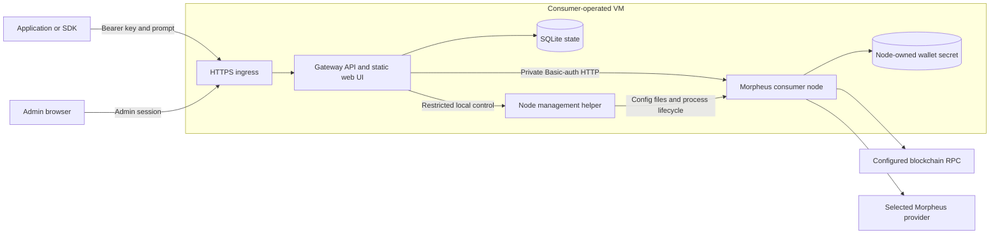
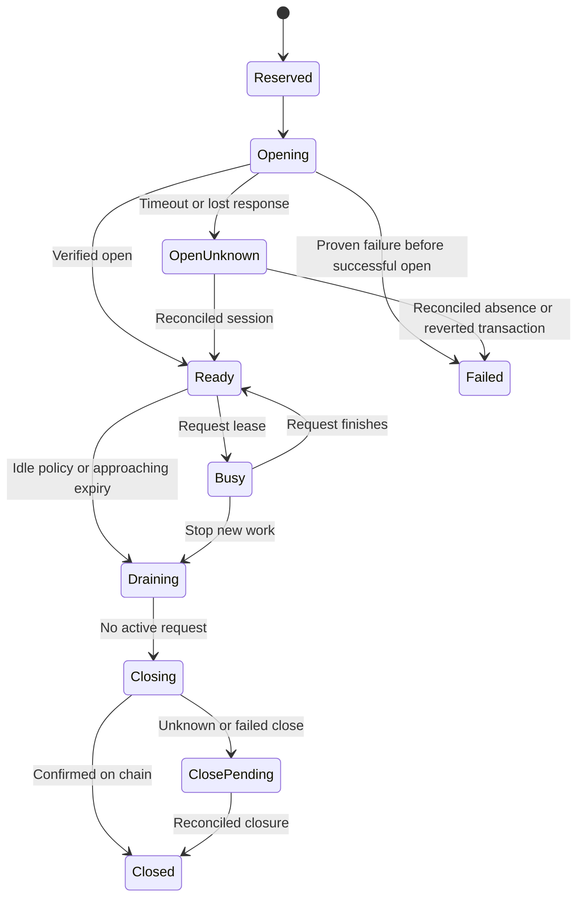

> Archived source review and full product plan. This describes the target product. See [IMPLEMENTATION.md](IMPLEMENTATION.md) for what v0.1 actually implements and its remaining work. Source checkout locations below refer to the original research workspace, not this standalone repository.

# Morpheus Consumer Gateway: product description and implementation plan

Prepared September 12, 2026. Working product name: **Morpheus Consumer Gateway**. “Lite client” describes the intended footprint; “gateway” describes what users deploy.

## 1. Recommendation

Build a small, self-hosted service beside a user's Morpheus consumer node. It serves a basic browser administration UI and an OpenAI-compatible inference API. Applications provide a base URL, a locally issued API key, a model, and a prompt. The service resolves the model, finds an eligible provider, acquires or opens a session, forwards the request through the user's node, and manages the session afterward.

The deployment belongs to the consumer. The consumer's node holds the wallet and handles Morpheus transactions, provider communication, and verification. The gateway owns API authentication, user policy, session pooling, and the web UI. A narrow local management helper applies approved configuration changes and controls the node process.

**Recommended starting point:** a new, focused application using FastAPI, a static React/TypeScript UI, and SQLite, deployed with the existing Go proxy-router. Extract useful API code and adapt selected desktop components. Keep the protocol implementation in the node. Support one installation, one consumer wallet, and multiple application API keys in the first release.

This delivers the hosted API's convenience while allowing consumers to operate their own entry point and choose their own providers. It does not make provider inference local, remove blockchain/RPC dependencies, or guarantee that a provider reserves GPU memory for a hot session.

The main engineering work is reliable orchestration: preventing duplicate opens, preserving provider policy across retries, reconciling on-chain state after failures, managing stake availability, and applying configuration without misleading the operator.

## 2. Research scope and evidence

This plan is grounded in source inspection of these public snapshots, rather than inferred from READMEs alone:

| Codebase | Snapshot inspected | Focus |
|---|---|---|
| Morpheus-Marketplace-API | `c2180d952bc9c4ec3117d37a10fc542d56ff2da3`, September 8, 2026 | Model resolution, session selection and automation, proxy transport, streaming/failover, API keys, persistence |
| Morpheus-Lumerin-Node | `99a8d86af1f9453d59797f9a208aa729ff3eb00d`, September 9, 2026; commit describes v7.11.0 | HTTP controllers, session opening and closing, provider rating, config loading, auth, concurrency, recovery, capacity, relevant contracts |
| Electron `ui-desktop` | Same node snapshot | Actual chat opening flow, renderer/main-process boundary, service orchestration, settings, session and balance UI |
| Separate historical Lite-Client | `9761bf900628ec4b51dacd309ccc421ab6106219`, April 7, 2024 | Naming overlap and whether it offers a relevant implementation base |

At the time of the initial review, the local workspace contained provider configuration and benchmarking material, not these application repositories. The public repositories were cloned to `/tmp/morpheus-lite-research/`. On September 13, the exact reviewed API and node snapshots were also cloned into `research/Morpheus-Marketplace-API/` and `research/Morpheus-Lumerin-Node/` in this workspace; the latter includes the Electron application under `ui-desktop/`. These are the reviewed snapshots, not newly updated upstream versions. Existing provider configuration was not modified. Source links below are pinned to the inspected commits so the findings remain reviewable as upstream changes.

**Evidence limits:** this is a static architecture review, not a full repository audit, live-node integration test, contract deployment verification, or performance benchmark. Production environment variables were not available. References to existing behavior describe the inspected code; proposed endpoints and features are explicitly labeled. Runtime-sensitive findings become verification tasks in phase 0. The node documentation export could not be fetched through the browser tool; relevant checked-in documentation and implementation were read directly instead.

## 3. What the existing code already provides

### 3.1 API: the best source of orchestration patterns

`SessionRoutingService` already resolves a requested model, claims an idle session, opens one when needed, tracks active requests, closes idle sessions, and maintains preferred models through a background loop. Its PostgreSQL implementation atomically claims idle sessions and keeps database connections out of slow session-opening calls. These are useful patterns for the new service. [Session routing implementation][A1]

However, the current opening path does more than rank providers: it intersects node-rated bids with externally published healthy bid IDs, sorts candidates by price, applies hosted-service gates, and opens a specific bid. Preferred/premium model policies, shared user pools, PostgreSQL SQL, and optional Redis-backed accounting are intertwined with routing. Extract responsibilities; do not copy the service wholesale. [Bid selection and opening][A1], [catalog handling][A2]

Reusable pieces include API-key generation and hash verification, proxy HTTP transport/error translation, model alias handling, cancellation-aware stream cleanup, and provider-failure classification. The complete API handlers carry billing, user, and hosted authentication dependencies that this product does not need. [Key primitives][A3], [proxy adapter][A4], [streaming][A5], [failover][A6]

### 3.2 Node: the protocol engine already exists

The node exposes model and bid discovery, rated bids, opening by model or bid, session lookup and closing, wallet/balance information, and OpenAI-shaped inference endpoints. Remote inference is selected through the `session_id` header; the JSON `model` field alone is not the gateway's complete remote-routing mechanism. Its HTTP API uses Basic authentication and supports method-scoped users. [Blockchain routes][N1], [prompt controller][N2], [auth reference][N3]

Opening by model performs provider selection, health checks, provider session initiation, allowance handling, an on-chain open, and session registration. The gateway should invoke a high-level open operation instead of separately orchestrating the provider handshake and raw contract call. Opening is one coordinated operation from the gateway's perspective. [Session service][N4]

The node already has consumer-side expiration cleanup and startup reconstruction from chain. This can be reused, but the gateway still needs to reconstruct its own pool ownership, policy, and pending-operation state. [Expiry and rehydration][N5]

### 3.3 Provider filtering and rating already exist, with important boundaries

The rating configuration supports `providerAllowlist`, `providerDenylist`, `algorithm`, and the five weights `tps`, `ttft`, `duration`, `success`, and `stake`. Empty allowlist means unrestricted providers; denial takes precedence. The default scorer divides its weighted quality score by the bid's price per second. Thus price already influences ranking, even though there is no separate price-weight slider. [Filtering][N6], [scoring][N7], [rating schema][N8]

**Critical boundary:** `openSessionByBid` fetches the requested bid and enters `tryOpenSession` without calling the rating allow/deny filter. It still performs the common provider health and applicable TEE checks. Opening by model uses rating-filtered candidates. Therefore the gateway must validate provider eligibility before every explicit-bid open and every session reuse; the rating file alone is insufficient as an access-control boundary. [Both opening paths][N4]

Rating configuration is loaded at startup. I found no HTTP endpoint or watcher that applies new rating JSON to the running rating object. The file takes precedence over inline `RATING_CONFIG_CONTENT`; the legacy `PROVIDER_ALLOW_LIST` environment variable is additionally merged into the allowlist. The management UI must expose and eliminate this source of configuration drift. [Loader][N9], [rating factory][N10], [startup wiring][N11], [system routes][N12]

### 3.4 Electron: reuse presentation and domain understanding selectively

The current chat path calls `/blockchain/models/{id}/session` with duration, direct-payment, and failover fields. It calculates a duration from the selected model's bids, balance, and metadata. There is also an `OpenSessionModal` with manual duration and stake estimation, but that file's presence should not be mistaken for proof that the main chat flow currently uses it. [Actual chat flow][E1], [HTTP call][E2], [duration modal][E3]

Useful UI concepts include model/provider lists, balances, session countdowns, service status, and settings. The renderer depends on `window.ipcRenderer`, desktop auth access, and main-process service management. Its orchestrator writes `.env`, `models-config.json`, and `rating-config.json`, then manages local processes. A hosted browser cannot use that boundary; replace it with authenticated backend APIs. [Renderer client][E4], [orchestrator][E5], [settings][E6]

The similarly named historical `MorpheusAIs/Lite-Client` is an Electron application with bundled/local Ollama integration. It is not the implementation base for this server product. Avoid naming that implies it already supplies the proposed functionality. [Historical package][L1], [Ollama integration][L2]

### 3.5 Findings that should change the implementation plan

| Finding | Product or engineering consequence |
|---|---|
| Node serializes requests per session with a semaphore | Model a session as one concurrent request slot. Scale through a bounded pool of sessions. [Semaphore][N13], [sender use][N14] |
| API creates its routed-session row only after opening succeeds | Add a durable opening intent before the transaction call; otherwise crashes and concurrent opens are hard to reconcile. [Routed-session model][A7] |
| API transport retries session-opening POSTs | Do not inherit generic retries for ambiguous transaction outcomes. A timeout is not proof that no session opened. [Proxy adapter][A4] |
| API policy parser can fall back to empty policy on malformed configuration | Managed security policy must reject invalid input and preserve the last valid revision. [Policy parser][A8] |
| Some API failover comments say early close locks unused stake and natural expiry avoids holds | These comments conflict with current node docs and settlement semantics. Reuse the algorithm only after correcting its financial assumptions. [Failover comments][A6], [session states][N15] |
| Node contains a stake-estimation function, but I found it exposed through the mobile SDK, not the HTTP routes | Do not invent a stock HTTP quote endpoint. Add one or compute an explicitly labeled estimate from verified inputs. [Estimator][N4], [mobile exposure][N16], [HTTP routes][N1] |
| Failover flag reaches `tryOpenSession`, but that function does not persist it; no setter call was found in the inspected tree | Treat built-in failover activation as unverified and possibly regressed. Gateway-owned failover is the recommended control point. [Session service][N4], [session model][N17] |
| Weight validation uses exact floating-point equality to 1, without invoking the full JSON schema in the factory | Validate all ranges and required fields in the new backend; verify generated JSON with the node's actual parser. Consider an upstream tolerance fix. [Weight parser][N18], [factory][N10] |
| Node's strict health selection relaxes to permissive for a single candidate provider | Do not present that existing switch as an unconditional healthy-only guarantee. Product policy must state how unknown/degraded providers are handled. [Selection policy][N4] |

## 4. Product experience

### Deployment and first use

The consumer provisions a Linux VM, installs the compose bundle, supplies an RPC endpoint and a consumer-node wallet secret, and starts the services. A GPU is unnecessary for a consumer-only installation. The installer prints a one-time admin setup secret through the operator's terminal. The consumer opens their own HTTPS address, claims the installation, reviews node connectivity and wallet readiness, enables models, chooses session/provider policies, and creates an application API key.

The basic integration is then:

```http
POST https://ai.example.com/v1/chat/completions
Authorization: Bearer <consumer-generated-api-key>
Content-Type: application/json

{
  "model": "my-preferred-model",
  "messages": [{"role": "user", "content": "Explain this code."}],
  "stream": true
}
```

`my-preferred-model` is an operator-configured alias for a canonical on-chain model ID, not a promise that this example name exists in the marketplace. The caller does not need a session ID, wallet key, node password, provider URL, or transaction handling code.

For users with an existing node, offer an attach mode. The gateway can manage its own keys and session policies immediately. Editing node files or restarting that node requires the local management helper or an explicitly configured operator integration. Without one, display the generated configuration and an unapplied status; do not claim a remote edit succeeded.

### Basic web UI

| Screen | What the user can do | Essential feedback |
|---|---|---|
| Overview | Copy base URL; inspect node and wallet readiness; pause new opens | Ready/degraded/blocked state, active requests, hot sessions, pending opens/closes, liquid MOR, escrow, on-hold MOR, ETH gas balance |
| Models | Enable models; set aliases; set duration and retention policy; prewarm now | Canonical ID, eligible provider count, warm/cold/busy state, estimated stake, catalog freshness |
| Sessions | Inspect provider, expiry, activity, stake, pending operations; close/drain | Separate inference expiry from confirmed on-chain closure; renewal and degraded-state indicators |
| Providers | Add addresses to allow/deny rules; inspect providers by model | Why each provider is eligible/excluded, bid/score, last successful contact, health source and timestamp |
| Rating | Adjust five weights; preview ranking; restore defaults; view JSON | Current applied revision, proposed order, warnings, restart requirement |
| API keys | Create, name, revoke, constrain models and rate/concurrency limits | Show secret once; show prefix, last use and usage afterward |
| Node settings | Manage supported RPC/config fields; inspect config source; apply changes | Validated diff, saved/applied distinction, drain/restart progress, rollback outcome |
| Diagnostics | Inspect redacted errors and operation history; export a support bundle | Request ID, failure stage, provider/model/session identity, no prompt content by default |

Optional small playground: choose a model and submit a test prompt. It uses the same request pipeline as application traffic and makes cold-open latency visible. It is a diagnostic convenience, not a full chat-history product.

### Session controls must use distinct concepts

| Control | Meaning |
|---|---|
| Session duration | Requested lifetime of each newly opened on-chain session |
| Retention mode | Whether an idle session closes early, stays until expiry, or is replaced to maintain availability |
| Idle timeout | In on-demand mode, how long an unused session remains open after activity finishes |
| Keep warm until | Optional absolute deadline for maintaining a model's session pool |
| Minimum ready sessions | Target count of idle, usable sessions; default zero unless warm mode is enabled |
| Maximum total sessions | Bound on usable, opening, draining and not-yet-closed sessions, with an explicit bounded replacement allowance |
| Request deadline | Maximum time a caller waits for admission, opening and inference; separate from session duration |

Offer three retention modes:

1. **On demand:** open on first request; reuse; close after the idle timeout. This is the default.
2. **Keep until expiry:** open on first request or prewarm now; do not idle-close; do not renew without demand.
3. **Maintain availability:** prewarm and replace expiring sessions while the schedule, resource limits, and wallet reserve allow. This is an explicit opt-in.

Example: duration 60 minutes plus “keep until expiry” holds that session open even if no more prompts arrive. Duration 60 minutes plus “maintain availability until 18:00” requests successive sessions until that deadline. Changing duration affects future opens; it does not mutate an existing session's expiration.

An existing compatible hot session may be reused even if its original duration differs from the current default. Require enough remaining lifetime for the admitted request. An exact new lifetime belongs on a prewarm/admin operation, not an ordinary prompt field.

## 5. Proposed architecture



Only HTTPS ingress is published. The node's admin API stays on loopback or an unpublished container network. Consumer operation does not require publishing the provider TCP listener. Keep the helper off public TCP entirely. [Node network guidance][N19]

### Component ownership

| Component | Owns | Must not own |
|---|---|---|
| Web UI | Forms, previews, progress, diagnostics | Wallet signing, direct node credentials, arbitrary filesystem access |
| Gateway | Bearer keys, policies, model resolution, session leases, request forwarding, lifecycle intents | Provider protocol reimplementation or browser-delivered wallet secrets |
| Node adapter | Version-specific request/response conversion, error classification | User policy hidden in transport retries |
| Session manager | Admission, prewarming, renewal, drain and reconciliation | A second independent provider-ranking algorithm |
| Management helper | Fixed config paths, validation/apply operations, node process supervision | General shell execution, generic file browser, Docker daemon access |
| Consumer node | Wallet, on-chain operations, provider handshake, inference transport, TEE verification, native cleanup | Public application API-key UX |

### Stack decision

**FastAPI + React/TypeScript + SQLite** is recommended for the first version because the most relevant API transport and stream-handling code is Python, the desktop UI is React, and this is a single-installation service. Use a single gateway worker/process with explicit async tasks and local persistence. Build static UI assets at release time; there is no Node.js frontend server at runtime.

SQLite is a deliberate adaptation, not a database URL swap. The existing API uses PostgreSQL-specific `FOR UPDATE SKIP LOCKED` and advisory locks. Replace those with transactional compare-and-set claims, a single lifecycle owner, and short SQLite write transactions. Do not hold a database transaction during provider/RPC calls. Multiple workers must fail startup or be explicitly unsupported in the initial release. [Existing claim implementation][A1]

| Alternative | Benefit | Tradeoff / decision |
|---|---|---|
| Full hosted API fork | Most code initially present | Carries authentication, billing, catalogs, databases and hosted policies; avoid |
| New Go gateway | Small runtime; familiar to node maintainers | Less direct Python reuse; reasonable if Go ownership dominates |
| Add all gateway features inside the node | Shared state and fewer process boundaries | Larger node attack surface and tighter releases; defer product layer integration |
| Port the whole Electron renderer | Familiar UI | IPC, wallet and desktop lifecycle assumptions make this more work than selective reuse |
| Generic OpenAI reverse proxy alone | Fast URL/key façade | Does not solve Morpheus session lifecycle, provider rules or configuration application |
| PostgreSQL from day one | Easier reuse of existing concurrency SQL | Additional service and operations; choose if multiple gateway replicas are an actual first-release requirement |

Use the existing node scorer through rated-bid APIs. A future shared Go package could avoid duplication if the gateway moves to Go, but `internal/` packages are not a general external SDK to import unchanged.

## 6. Request and session lifecycle

### Request flow

1. Authenticate the application key. Enforce model access, payload limits, rate limits and concurrency limits before any chain activity.
2. Resolve the requested alias to one canonical model ID. Unknown or ambiguous names produce an explicit error. Do not silently substitute another model.
3. Build the effective policy: installation limits, model overrides, then key restrictions. Keys may narrow permission; they cannot expand it.
4. Look for an idle session compatible with the wallet/network, model, current provider/security rules and minimum remaining lifetime. Atomically lease it.
5. If no session is ready, join an existing opening operation or enter the bounded queue. If capacity is authorized, reserve a pool slot and stake budget, persist an opening intent, and ask the lifecycle owner to open.
6. Fetch node-rated bids; retain score order; filter by current provider rules, supported capabilities, cooldown, price/stake limits, and trust requirements. Revalidate the chosen bid immediately before opening it.
7. Open the chosen bid through the node. The node performs provider initiation and the chain operation. Persist the operation's outcome and verify the resulting session's provider, model, wallet, expiration and closure state before marking it ready.
8. Forward the inference body through the node with gateway-generated `session_id`, `model_id`, request ID and an isolated chat ID. Stream the response with backpressure.
9. Release the lease in cancellation-safe cleanup. Update activity and operational usage; schedule retention or renewal work according to policy.

Using explicit bids makes hard provider filtering and explainable score order practical. It also means the gateway owns candidate iteration and must compensate for the by-bid filter boundary identified above. Do not reuse the hosted API's unconditional cheapest-first sorting when the user has configured proxy rating weights.

### Cold opens and concurrency

Two requests arriving at the same cold model must not automatically create two sessions. Persist a reservation under a per-pool coordination lock; later requests await that operation or queue. If the configured maximum is greater than one and demand persists, additional slots may open under the same global limits.

A session is one concurrency slot in the inspected node. Default to one session per model and a finite queue; let users raise concurrency with a clear indication that additional sessions require additional stake. Count opening and unresolved operations against limits so a burst cannot bypass caps. [Node concurrency implementation][N13]

A useful first configuration is 30-minute sessions, a 5-minute idle timeout, no automatic prewarming, one session per model, and a 30-second queue wait. These are **proposed product defaults**, not network requirements or latency promises. Cold-opening deadlines should be separate and configurable; measure them during phase 0 before choosing a shipped value.

### State and recovery



These are **gateway states**, distinct from on-chain session fields. Expiration independently makes a session ineligible for inference; it does not prove closure or release funds. Preserve an expired-but-unclosed marker alongside lifecycle state.

Persist an intent before submitting an open. An HTTP timeout after a transaction might have been submitted moves it to `OpenUnknown`; it must not become a new unrestricted retry. Freeze further opens for the affected pool while reconciling, retain its resource reservation, and expose the unresolved operation in the UI.

**Stock-node limitation:** the high-level open response does not supply a complete idempotent transaction-operation API. Session IDs can also be lost at the HTTP boundary when the service returns an error after an on-chain success. A local intent plus wallet-session scans reduces uncertainty but cannot always identify an operation conclusively. For strong automatic recovery, add node-supported idempotency and durable operation status, or keep ambiguous cases paused for operator resolution. Do not claim exactly-once opens with the current API. [Open service and response handling][N4], [controller][N1]

On startup, restore policy first, then reconcile intents and gateway-managed sessions against the node/chain before opening anything. Clear stale local leases only after the old gateway process has ended and upstream request state has been accounted for. Provider identity that cannot be verified makes a session ineligible, not optimistically reusable.

Sessions created outside the gateway should be shown as unmanaged. Do not silently adopt or close them. Recommend a dedicated wallet/node for managed deployment because wallet-wide recovery cannot otherwise cleanly distinguish independent operators' activity.

### Expiry and maintaining availability

Use the verified on-chain `endsAt`, not just request-start time plus requested duration. The inspected contract imposes a five-minute minimum and derives/clamps the actual end time using stake and configured maximum duration. Read the deployed maximum and relevant inputs; do not treat the desktop's 1,440-minute input maximum as a permanent protocol rule. [Contract session validation][N20], [duration storage][N21]

Stop assigning work when remaining time is below a configurable inference allowance plus clock skew. For maintained availability, open a replacement before the old session becomes ineligible. A replacement is a new session, possibly with another allowed provider; there is no assumed in-place extension. Count overlap against wallet and session limits. If overlap is unaffordable, report reduced availability and queue or reject within the caller's deadline.

Do not extend an active request past hard session expiry by pretending the session is still valid. Define a maximum request duration and cancellation path. A replacement cannot seamlessly continue an already partially delivered generation.

The node's expiration worker should remain the normal natural-expiry closer. The gateway handles intentional early closes and monitors eventual closure; a delayed reconciler repairs unresolved cases after checking chain state. Serialize gateway-originated transactions. That alone cannot serialize the node's independent expiration worker: verify nonce handling under simultaneous opens/closes and prefer a node-wide transaction coordinator for public release. [Expiry worker][N5], [API throttle rationale][A1]

## 7. What “hot” means and how MOR should be represented

In this product, a hot session means an open, policy-eligible, routable session that avoids another on-chain opening sequence. It is not a contractual promise of dedicated GPU capacity, preserved KV cache, a loaded model, or a response-time SLA.

The provider code supports capacity policies based either on open sessions or recent activity. In the activity-based implementation, an idle open session can stop counting toward capacity. Therefore a long-lived session and a reserved compute slot are different promises. Do not send artificial inference requests just to keep provider activity counters alive. Optional health checks should be low-rate and clearly separated from inference. [Provider capacity policies][N22]

For standard staking mode, opening escrows MOR. The node's stake calculation uses supply, bid price, requested duration, and daily emissions budget; `pricePerSecond × seconds` is not itself the required escrow. An estimate must come from the selected bid and current inputs using integer arithmetic. At close, unused stake returns; the used portion can enter a day-lock and later be claimed. ETH pays transaction gas. Treat direct payment as a separate mode and defer it from MVP. [Stake computation][N4], [settlement reference][N15]

Display separate balances for liquid MOR, open-session escrow, unresolved opening reservations, time-locked amounts, releasable amounts, and ETH gas. A closed session should not appear to have returned its full stake unless that is verified. Expose claimable funds through the node's existing on-hold/withdraw APIs, with a distinct user action or an explicitly enabled bounded claim policy. [Stake routes][N1]

Resource controls should include per-session maximum escrow, installation-wide outstanding escrow/reservations, minimum liquid MOR reserve, concurrent-session limits, bounded opening attempts, gas reserve, and a daily gross-allocation/day-lock budget. Count unknown opens and pending closes conservatively. Use integer wei or decimal strings throughout; do not port float-based money calculations from UI or API code.

**Preflight estimates are not hard limits.** The node recalculates amounts during an open and chain inputs can change. A promised maximum must be checked against the actual amount before signing/submitting, ideally in the node with the selected bid and policy revision pinned. The current high-level API lacks that request-level cap. A stock-node prototype may show estimates and conservative reservations; the public release must either add enforcement or clearly omit the hard-cap promise. Recheck approvals separately: an allowance is permission, not a transfer or balance.

## 8. Provider policy and rating behavior

### Provider rules

Use provider identity from the on-chain bid record, scoped to the configured chain. Do not use the DNS endpoint as the primary identity. Normalize addresses for comparison and reject malformed input.

Recommended semantics:

```text
eligible = provider is not denied
           AND (mode is unrestricted OR provider is in the explicit allowlist)
           AND model/key restrictions permit the request
           AND required capability/trust checks pass
```

The UI should offer “All providers except denied” and “Only these providers.” In the latter mode, an empty list means **no providers**, not unrestricted access. The node's empty-list semantics differ, so the gateway must reject or represent that state explicitly and block opening; never serialize an empty strict allowlist and imply the node enforces deny-all. [Native filter semantics][N6]

Start with installation-wide provider rules. Model-specific restrictions can be added next using the gateway's candidate filtering; do not rewrite a single global node rating file for each request. Future key-specific policies must be intersection-based. Sharing a session across keys is safe only when each key's effective policy permits that provider and chat/request context is isolated.

Apply rules at discovery, warm-pool selection, new opens, automatic renewals, manual prewarm, retries and failover. If a provider becomes denied, stop assigning new work immediately. By default, already dispatched requests finish and the session drains; offer an explicit “cancel active requests” action for urgent revocation. A newly allowed provider cannot be used until all relevant policy layers permit it.

Recheck policy after a slow opening completes. If the provider was denied while opening, quarantine/drain the resulting session and do not dispatch the queued prompt. This avoids a race between a policy update and an in-flight chain transaction.

### Rating UI

Expose the existing algorithm and five weights, with the node's current defaults:

```json
{
  "algorithm": "default",
  "providerAllowlist": [],
  "providerDenylist": [],
  "params": {
    "weights": {
      "tps": 0.24,
      "ttft": 0.08,
      "duration": 0.24,
      "success": 0.32,
      "stake": 0.12
    }
  }
}
```

This is the actual node configuration shape. Validate required fields, finite numeric values, range 0–1, address uniqueness after normalization, and the weight sum. Use constrained percentages/presets and confirm serialized values pass the version-specific Go validator. Do not silently accept unknown algorithms or malformed policy. [Defaults][N9], [schema][N8], [weight parser][N18]

A ranking preview should show eligible bids for a selected model, current score order, price, available component statistics, and exclusion reasons. Reuse the real scorer for a draft-weight preview through a proposed validation/preview endpoint or a local helper that links that implementation. Until this exists, show only the current applied ranking; avoid approximating the algorithm in JavaScript and labeling it authoritative.

Describe `duration` as historical provider/model session-duration statistics and `stake` as provider stake, not the consumer's desired session length or wallet balance. State that final scoring is price-adjusted. Presets such as latency or reliability are proposed weight combinations, not guaranteed outcomes. New providers with little history and sparse statistics need an explicit test case. [Scorer][N7]

## 9. Applying changes on the VM

**Required for the first release: the service can trigger a node restart on the same VM.** The web UI must provide a **Restart node** action and an **Apply and restart** action for settings that require it. Neither action requires the operator to SSH into the box. The service stops assigning new requests, waits for active requests to finish within a configured deadline, triggers the restart locally, checks node readiness, reconciles sessions and resumes traffic. An explicitly selected immediate restart may interrupt active requests. Restarting the node process is separate from rebooting the VM; the gateway and dashboard remain available to show progress and errors.

The browser submits a typed setting to the gateway; the gateway records the desired revision; the management helper validates and writes only approved paths. The browser never writes arbitrary files or supplies commands.

### Recommended management mechanism

In the managed compose deployment, wrap the pinned node process with a small supervisor/helper running as the node's non-root user. It owns the node process and a fixed configuration directory. Expose a versioned, restricted Unix-socket API to the gateway for operations such as read supported config, validate rating, apply rating, restart node and report status. Mount the socket through a narrowly permissioned directory. The gateway container has no Docker socket or wallet-secret mount.

For a systemd installation, provide an equivalent fixed-service integration. Do not build both packaging paths before the compose deployment works. Attach mode without a helper remains useful as a limited inference integration but does not meet the full product's required file/restart-management capability. The supported full installation must provision the helper or equivalent fixed-service permissions.

### Apply transaction

1. Validate the full candidate config and supported node version; reject arbitrary paths, executable values and unknown policy fields.
2. Compare the edit's base revision with the active revision; reject stale edits rather than overwrite another admin's changes.
3. Persist desired state, normalized content hash and a redacted diff. Report the effective source, including file/environment/legacy overrides.
4. Immediately apply more restrictive provider rules in the gateway. Queueing/opening reads a stable policy revision.
5. Stage the file in the node-owned directory, flush it, and atomically rename it. Keep a last-known-good copy and an apply journal.
6. If the node cannot reload rating, stop new admissions, drain active requests within a deadline, then restart the node process through the helper. The gateway/UI remains reachable.
7. Verify process health, version, loaded configuration where observable, and rated-bid behavior. Reconcile sessions before resuming.
8. Mark the revision applied only after verification. On failure, restore the previous file and attempt a controlled restart; otherwise leave service blocked with a concrete error.

Use a directory mount for managed configuration. Atomic replacement of a file that is individually bind-mounted can leave another container reading the old inode. Avoid having both gateway and helper write the same path. A mounted secret supplies wallet material separately from editable non-secret settings.

The UI needs **saved**, **applying**, **applied**, **pending restart**, **failed** and **drift detected** states. A settings save should return an operation ID; the page watches progress. Node restart can interrupt traffic, so the user chooses “apply after drain” or an explicit immediate restart. It must not happen invisibly during an ordinary form save.

A restrictive provider change must remain enforced by the gateway even if node restart fails. A permissive change waits for the restrictive old node filter to be replaced. Rating-weight changes require the node's new scorer before the UI calls them effective.

### Upstream improvement

Add authenticated node operations to read/validate/apply rating configuration and expose the active configuration hash. Validate a new immutable rating object, persist it, then swap it safely at runtime; retain the previous object if validation or persistence fails. This removes most restarts and makes applied-state verification precise. These APIs are proposed additions, not existing `/config` features.

## 10. API contract and compatibility

### Public inference API: proposed

| Endpoint | Scope | Behavior |
|---|---|---|
| `GET /v1/models` | Inference key | Enabled, resolvable models permitted for that key; standard list envelope |
| `POST /v1/chat/completions` | Inference key | Automatic session acquisition; streaming and non-streaming |
| `GET /healthz` | Minimal unauthenticated check | Process liveness only; no wallet or topology detail |
| `GET /readyz` | Private monitoring | Dependencies and recovery readiness |

Optionally provide `/api/v1` as a compatibility alias for applications migrating from the hosted API. Document a single canonical base URL to avoid duplicated `/v1/v1` paths. Defer embeddings, audio, images, Responses and agent-tool endpoints until their transport and lifecycle behavior are tested; OpenAI compatibility should identify supported endpoints and fields, not imply every feature.

Preserve supported messages, tools/tool calls, sampling fields, structured output options, streaming usage and provider extensions that the pinned node can carry. Explicitly reject unsupported features. Do not silently drop fields or label locally estimated token counts as provider-reported usage. Include request ID in response headers; keep session/provider detail in authenticated diagnostics rather than altering standard completion payloads.

Use model policies in the UI for duration and provider choice. An optional key-authorized `X-Morpheus-Profile` header can select a preconfigured routing profile later. Do not accept caller-supplied provider URLs, node URLs, wallet keys or arbitrary session IDs. Do not add mandatory nonstandard fields to ordinary chat requests.

### Admin API: proposed

| Endpoint group | Responsibility |
|---|---|
| `/admin/api/setup`, `/login`, `/logout` | First-run claim and browser sessions |
| `/admin/api/keys` | Local application key lifecycle |
| `/admin/api/models`, `/policies` | Enabled models, aliases, retention and limits |
| `/admin/api/providers`, `/rating/preview` | Rules, explanations and ranking preview |
| `/admin/api/sessions`, `/sessions/prewarm`, `/sessions/{id}/close` | Managed sessions; asynchronous operations |
| `/admin/api/node/config`, `/node/apply` | Supported settings and managed application |
| `/admin/api/node/restart` | Trigger a local node restart, returning an operation ID for drain/restart/readiness progress |
| `/admin/api/operations/{id}` | Pending opens, closes, config applies and recovery |
| `/admin/api/wallet/status`, `/wallet/claim` | Readiness and explicitly authorized releasable-stake claim |

Use administrative idempotency keys and optimistic config revisions. A repeated prewarm/close/apply operation must return its existing operation or outcome. This does not by itself make an unmodified node's session-opening POST idempotent.

### Stock node API mapping

| Gateway need | Existing node operation | Qualification |
|---|---|---|
| On-chain model catalog | `GET /blockchain/models` | Paginated; cache locally; metadata availability may vary |
| Ranked candidates | `GET /blockchain/models/{id}/bids/rated` | Uses node's currently loaded scorer/filter |
| Inspect selected bid | `GET /blockchain/bids/{id}` | Revalidate identity, model and current bid data |
| Model-level open | `POST /blockchain/models/{id}/session` | Existing integrated flow; selects internally |
| Explicit-bid open | `POST /blockchain/bids/{id}/session` | Body includes `sessionDuration`; gateway must enforce filters |
| Session truth | `GET /blockchain/sessions/{id}` | Verify on-chain identity and end/close times |
| Wallet session reconciliation | `GET /blockchain/sessions/user?user=...` | Paginate; separate managed/unmanaged sessions |
| Close | `POST /blockchain/sessions/{id}/close` | Observe confirmation; no separate recover RPC |
| Inference | `POST /v1/chat/completions` | Node Basic auth plus internal session/model/chat headers |
| Runtime config inspection | `GET /config` | Sanitized node config; not a generic rating editor |
| Runtime RPC change | `POST /config/ethNode` | Verify restart persistence through managed config |
| Held/releasable stake | `GET /blockchain/stakes/onhold`, `POST /blockchain/stakes/withdraw` | Separate from session close |

Check exact schemas against the pinned controller and Swagger definitions during implementation. A backend function or mobile SDK method is not automatically an HTTP endpoint. [Blockchain controller][N1], [system controller][N12], [Swagger][N23]

## 11. Failure behavior, privacy and trust

### Retry and failover policy

The gateway owns failover so every replacement respects the same provider rules, resource caps and session accounting. Disable reliance on automatic node failover for managed sessions, verify that behavior on the pinned version, and reject unexpected protocol control messages rather than forwarding non-JSON control text as normal completion chunks.

| Failure | Response |
|---|---|
| Invalid key/model/request | Return a standard error; no session creation |
| No eligible provider after policy filtering | `503` with a stable `no_eligible_provider` code; no policy relaxation |
| Queue or key concurrency limit | `429`, retry hint, bounded wait |
| Provider refuses initiation before any chain open | Try the next eligible provider within attempt/deadline limits |
| Open outcome unknown | Persist uncertainty; reconcile; no blind new open |
| Provider unavailable before output | At most a bounded retry to a distinct allowed provider, after classifying the failure |
| Partial stream already delivered | Do not stitch a new generation onto it; terminate with a documented stream error |
| Provider backend returns capacity/rate-limit error | Treat as provider impairment when attribution is reliable; cooldown by model/provider |
| Request invalid, local auth failure, trust verification failure | Surface the specific error; do not use provider failover to bypass it |
| Insufficient MOR, gas or resource reservation | Block new opens; allow already valid sessions where possible |
| Node/RPC unavailable | Reuse only when validity and policy remain established; block uncertain opens and report degraded status |
| Client disconnects | Cancel upstream inference, release lease safely, reconcile any outstanding opening operation |
| Close fails or remains unknown | Stop using the session, retain escrow accounting, retry/reconcile with backoff |

The existing API's pre-output failover and cancellation cleanup are good references. Some ambiguous non-streaming failures may mean inference already ran remotely: this is at-least-once execution risk even if the caller received nothing. Do not promise exactly-once inference or automatically replay side-effecting agent tools. Tool definitions in chat requests are separate from executing tools in the gateway; the MVP does not execute them. [Streaming implementation][A5], [failure classification][A6]

### Security boundary

The public inference service indirectly authorizes activity using the consumer's wallet. Treat that as a real authorization boundary:

- Separate browser-admin authentication from application inference keys. An inference key cannot edit config, create more keys, export wallet material or invoke arbitrary node routes.
- Generate high-entropy keys; store only their hashes and prefixes; show the secret once. Reuse the API's key primitives but omit recoverable encrypted API-key storage unless a future requirement justifies it. [Key primitives][A3], [existing key model][A9]
- Use a scoped node identity for inference/session operations and a separate narrow management channel. Do not expose Basic credentials to the browser as the Electron renderer does for local operation.
- Use secure, HttpOnly, same-site admin cookies with CSRF protection; authenticated setup; no default password, public registration, permissive CORS or hosted-API development auth bypass.
- Pin upstream destinations. Reject client-controlled internal routing headers and session IDs. Provider addresses and catalog URLs can lead to outbound requests; protect against metadata-service/private-network SSRF, with explicit overrides for intentional private providers.
- Keep prompts/responses out of application logs and diagnostic exports by default. Configure `PROXY_STORE_CHAT_CONTEXT=false` and `PROXY_FORWARD_CHAT_CONTEXT=false` for the API deployment and verify their behavior on the pinned build. Use request-isolated chat IDs so pooled sessions never merge unrelated callers' conversation context. [Node config fields][N26]
- Bundle UI assets locally; no mandatory analytics or remote UI scripts. Redact RPC tokens and secrets in settings, errors and audit logs.

Self-hosting removes the hosted Morpheus API from the request path. The VM operator still controls the host, configured RPC infrastructure observes blockchain activity, and providers process inference. Where TEE is required, preserve node verification and show its actual status. An allowlisted provider is not automatically TEE-attested; a TEE-tagged model is not a universal anonymity guarantee. [Node privacy and TEE distinctions][N19]

## 12. Catalog and decentralization policy

Make the node/on-chain registry the authority for canonical model and provider identity. Persist operator aliases locally and let users address a model by canonical ID when human-readable metadata is unavailable. Treat metadata as untrusted display data.

An external Morpheus catalog can optionally enrich names, capabilities and observed health, but it should not be mandatory for the core self-hosted path. The hosted API currently relies on external model/bid catalogs in candidate selection. Copying that behavior unchanged would recreate a centralized availability dependency even though prompts bypass the hosted gateway. [Catalog service][A2], [selection dependency][A1]

Distinguish registered, observed healthy, policy-eligible, and currently openable. An on-chain bid can exist while its provider is unreachable. Prefer local cached discovery plus bounded node handshake/health checks at opening; do not continuously probe the entire network. Show source and age for external health data.

If offering external catalog modes, distinguish ALL, ACTIVE and GATEWAY data. The hosted gateway's curated catalog is not the full marketplace. Never silently inherit hosted model allowlists or default fallback models. [Catalog semantics][N24]

Core validation target: with hosted Morpheus API and optional catalog domains unavailable, an enabled canonical model with discoverable on-chain bids can still be selected and opened, assuming the configured RPC and eligible provider are reachable.

## 13. Persistence and deployment operations

### Minimal data model

| Record | Important fields |
|---|---|
| Installation | Network/contract identity, wallet public address, pinned node version, management mode |
| Admin account/session | Password hash or chosen local auth identity, session expiry and revocation |
| API key | Prefix/hash, name, enabled state, model restrictions and limits |
| Model policy | Canonical ID, aliases, duration, retention, schedule, pool limits, provider restrictions |
| Config revision | Desired/applied hashes, source, base revision, apply operation, redacted diff |
| Session | ID, wallet/network, bid/provider/model, policy-at-open, verified expiry/closure, gateway ownership, escrow |
| Operation | Local idempotency key, type, stage, selected bid, reservation, known transaction hashes, result/uncertainty |
| Lease | Request ID, session ID, key ID, acquisition/heartbeat/deadline, release status |
| Provider observation | Model/provider identity, last success/error, cooldown, source and freshness |
| Audit/usage | Actor, action, request/operation ID, timestamps, latency and available token counts |

Store money in exact representations, timestamps in UTC, and durations in explicit units. Separate request counters from on-chain accounting. Expire operational history by retention policy; do not retain prompt bodies merely to debug sessions.

### Deployment package

Ship versioned images and a compose file containing HTTPS ingress, the gateway with built UI, and the node plus helper. Persist gateway state, node state, node auth, managed config and secrets appropriately. Pin compatible versions/digests; do not automatically follow `latest` during restart. Detect incompatible node versions and block only the features that cannot be guaranteed safely.

Use health checks and bounded readiness waits. On first boot, verify the wallet public address, network, RPC connectivity, ability to read models/bids, and required auth methods. Do not begin prewarming until the operator has enabled it and readiness checks pass. No local inference runtime or desktop dependency is needed.

Back up the database consistently together with policy/config revisions; back up wallet secrets through a separate encrypted operator process. A backup must not be restored into a second simultaneously active installation sharing the wallet. Restore in a paused state, reconcile on-chain sessions, then allow new activity.

During gateway upgrades, stop admissions, drain active requests, checkpoint state and migrate the database with a recoverable backup. Retain hot sessions where compatible. During node upgrades, show the interruption and reconcile afterward. Closing the browser does nothing to session lifetime. A graceful service shutdown can drain/close managed sessions if configured, but abrupt VM loss requires recovery after restart; it does not cancel contracts automatically.

## 14. Reuse plan

| Source | Reuse | Required change |
|---|---|---|
| API `core/security.py` | Key generation/hash verification | Local key model and scopes; remove hosted user dependency |
| API `services/proxy_router_service.py` | HTTP/auth conventions and error translation | Typed adapter; remove generic retries for chain mutations; protect sensitive errors |
| API `chat_streaming.py` / non-streaming handler | Stream parsing, cancellation cleanup, response handling | Remove billing/auth coupling; preserve compatibility; account for leases in one place |
| API `chat_failover.py` | Failure classification and pre-output boundary | Correct settlement comments; distinct-provider checks; current-policy and budget enforcement |
| API `session_routing_service.py` | Separation of routing, leasing, automation and lifecycle | Smaller modules, SQLite transactions, opening intents, bounded pools, operator policies |
| API `direct_model_service.py` / model routing | Alias/collision logic and caching ideas | Local-first catalog; optional enrichment; no automatic model substitution |
| Node rating package/schema | Scorer, defaults and native JSON shape | API/helper preview; runtime apply support; stricter validation and filter consistency |
| Node session/open/close/proxy APIs | Provider protocol and chain operations | Minimal reliability extensions rather than duplicating protocol code |
| Node expiry reconstruction | Startup and expired-session recovery | Coordinate gateway ownership, pending operations and nonce handling |
| Electron model/provider/session views | Presentation components and interaction patterns | Remove IPC/local auth; typed admin API data hooks |
| Electron orchestrator | Reference for config/process behavior | Replace with server supervisor and restricted helper |
| Historical Lite-Client | Naming/context only | No core code reuse recommended |

Create a provenance list for every copied file and retain required notices. The node and desktop declare MIT licensing. The API README also says MIT, but its linked top-level `LICENSE` file is absent from the inspected snapshot and its project metadata has no license declaration. Obtain the missing license/notice material from maintainers before redistributing copied code. If unresolved, implement against the API contracts and use the behavior as a design reference. This is a source-packaging task, not a reason to block the architecture work. [Node license][N25], [API README][A11], [API project metadata][A10]

## 15. Implementation sequence and acceptance criteria

The first milestone should be a vertical slice: one browser setting, one local API key, one model, automatic opening, two prompts reusing one session, and verified close. Do not begin by porting the whole desktop application.

| Phase | Deliverables | Exit criteria |
|---|---|---|
| 0. Compatibility spike | Pinned node/API contracts; source reuse/license review; session and funds behavior matrix; managed-helper prototype | Verify open/reuse/close, duration limits, real header semantics, concurrent-request serialization, failover flag behavior, restart recovery, rating apply and config precedence |
| 1. Inference vertical slice | Gateway auth, model alias, explicit-bid selection, basic session store/leases, chat JSON/SSE, node adapter | A stock SDK-style request cold-opens; a second request reuses; invalid keys cause no node mutation; no cross-request context leakage |
| 2. Durable lifecycle | Opening intents, bounded queue/pool, retention modes, prewarming/renewal, uncertainty recovery, fund reservations | Bursts respect limits; crashes/timeouts do not blindly duplicate opens; active work drains; closure and held funds are represented accurately |
| 3. Web administration | Overview, models, sessions, providers, rating, keys, typed config apply with helper | User changes duration/provider/rating rules in a browser; settings persist; denied providers cannot receive new work; saved/applied/rollback status is truthful |
| 4. Public beta hardening | Node reliability extensions or explicit constrained behavior, compose installer, compatibility tests, backups/upgrades, operational docs | No publicly reachable node admin API; no bypass of monetary/provider controls; full failure matrix passes; clean-VM install and restore demonstrated |
| 5. Extensions | Embeddings/audio, per-model rating profiles if warranted, optional external auth, more deployment modes | Each feature ships with an explicit compatibility and lifecycle contract |

Suggested module structure:

```text
gateway/
  api/inference/       # chat + models
  api/admin/           # settings, keys, sessions, operations
  auth/
  catalog/
  policy/
  sessions/            # admission, leases, retention, reconciler
  node/                # versioned HTTP adapter
  persistence/
  management/          # helper client
web/                   # static React UI
node-helper/           # fixed config/process operations
deploy/                # compose, ingress, secret/bootstrap tooling
tests/                 # contracts, failure injection, integration
```

### Recommended small node changes

These should be proposed upstream independently, generally targeting the node's development branch, with the gateway pinned to a compatible build:

1. **Consistent provider policy enforcement:** apply allow/deny checks to explicit-bid opening and relevant lower-level paths, not only rating-based selection.
2. **Durable opening operations:** client operation ID, idempotency, operation status and known transaction/session IDs even when registration or HTTP delivery fails.
3. **Actual-amount constraints:** accept maximum escrow/price constraints and validate the computed amount before approval/open submission; do not equate a UI quote with enforcement.
4. **Wallet-wide transaction coordination:** cover automatic expiration, manual close, opening, approval and claims so gateway locks are not the only protection.
5. **Rating validation/apply/readback:** share the actual parser/scorer and expose the active revision; harden weight validation.

Runtime rating reload is optional if a controlled restart meets the initial UX. Deterministic transaction outcomes and truthful resource enforcement are more important than avoiding an occasional settings restart. A stock-node prototype can proceed before these changes; public unattended automation needs either those guarantees or explicit paused/manual handling of ambiguous states.

### Required validation scenarios

| Scenario | Expected result |
|---|---|
| Two simultaneous cold requests, maximum sessions one | One opening reservation and one resulting usable session; other request waits |
| Load exceeds a configured pool limit | Queue then bounded error; no hidden stake-allocating scale-out |
| Gateway crashes before open submission | Intent reconciles without creating an unnecessary session |
| Gateway/node loses response after mined open | Operation remains unresolved until reconciled; no generic POST replay |
| Database write fails after successful open | Chain session is recovered from durable operation/inspection; reservation remains accounted |
| Deny provider while an open is pending | Completed session is quarantined; prompt is not sent to that provider |
| Allow and deny overlap; strict allowlist empty | Deny wins; strict empty configuration permits no providers |
| Failover and renewal | Same provider/security/resource rules as first open; no fallback to blocked provider or different model |
| Stream fails after tool/content chunks | No silent replay or concatenation of a new completion |
| Client disconnects during opening or streaming | Bounded task cleanup; no leaked lease; any submitted transaction reconciled |
| Session expires during long inference | Documented failure/cancellation; no false success |
| MOR/gas depleted or close funding fails | Clear blocked/pending state; no false return-of-funds display |
| Open near minimum duration or UTC budget rollover | Verify actual escrow/expiry against the deployed contract; do not rely on rounded UI estimates |
| Close across UTC release boundaries | Held/releasable values follow contract truth; daily reservations reset without losing unresolved operations |
| Malformed rating, unknown field, bad sum, legacy allowlist present | Reject or explicitly resolve; never default to a broader policy |
| Config apply/restart fails | Last good file restored or service remains blocked; UI does not say applied |
| Operator clicks Restart node or Apply and restart | Node restarts on the VM without SSH; dashboard stays reachable and reports drain, restart, readiness and recovery |
| Settings apply while inference is active | Drain policy honored; policy revision races handled |
| VM restarts with open sessions and pending closes | Reconcile before opening; recognize unmanaged sessions separately |
| Hosted API and optional catalogs unavailable | Canonical model routing still works through configured RPC/node/provider |
| Cross-key/chat isolation and malicious routing headers | No borrowed session access or context bleed; headers regenerated |
| Simultaneous node auto-close and gateway open | No uncontrolled duplicate/nonce storm; recovery is bounded |
| Clean upgrade and backup restore | State migrates safely; restored installation starts paused and reconciles |

Use fake node/provider/RPC responses for repeatable failure injection, then controlled test-network end-to-end runs. Run contract tests against the supported node build. Add real SDK/client integration fixtures only for the compatibility surface being promised. No such runtime tests were performed as part of this planning task.

## 16. Open questions and recommended defaults

These decisions are recorded for product/engineering review; none prevents producing this plan.

| Question | Recommended starting answer | Why it matters |
|---|---|---|
| Who is the first customer: individual, internal team or public reseller? | One operator or small trusted team | Determines auth, billing, abuse controls and tenancy scope |
| Must we support completely unmodified nodes? | Yes for prototype/attach; pinned compatible build for reliable unattended release | Current mutation/config APIs limit hard guarantees |
| Which node version/network is the supported baseline? | Pin and test an explicit release; read network config from the node | Contract and auth behavior cannot be assumed across arbitrary versions |
| What does “keep hot” promise? | Avoid session reopening; best-effort ready capacity | Dedicated GPU reservations need a separate provider capability/product agreement |
| Should a session stay for its whole selected duration? | User chooses retention mode; never conflate duration with idle timeout | Prevents early closing when the user expects a held session |
| Is continuous renewal allowed by default? | No; explicit per-model opt-in and limits | Unattended renewal reserves funds over time |
| Is an exact provider pin required? | Can be represented as a single-provider allow policy | Reduces availability and failover options |
| Global or per-model provider rules? | Global in MVP; model-level narrowing next | Native rating config is global |
| Global or per-model rating weights? | Global in MVP | Per-request rewriting/restarting the node is not viable |
| Should newly denied providers finish active responses? | Drain by default; explicit urgent cancellation | Already sent prompts cannot be recalled |
| Can multiple keys share sessions? | Yes within one installation if policy compatible and context isolated | Improves stake efficiency; changes per-key accounting expectations |
| Is exact per-key MOR accounting required? | Report request usage; apply installation-level escrow control | Shared session stake is not naturally attributable per token/key |
| Does “bring your API key” mean choose a secret or generate one? | Generate locally, with optional import of a sufficiently strong secret later | Keeps onboarding simple and keys independent of hosted accounts |
| How is the wallet provisioned/unlocked? | Node-owned mounted secret, terminal setup; no browser export/import in MVP | Headless operation and restart behavior must be verified |
| Is direct payment required? | Defer; standard staking only | Different financial expectations and validation |
| Are auto-claims needed? | Show releasable funds and manual claim first | Claims consume gas and must share transaction coordination |
| Must the service work without Morpheus-hosted catalogs? | Yes | Centralization preference is a core product requirement |
| Can operators use centralized RPC providers? | Their choice, configurable | The gateway does not eliminate blockchain access dependencies |
| Which API clients must work on day one? | Pick two concrete clients plus chat streaming/non-streaming fixtures | “OpenAI compatible” alone is too broad for acceptance |
| Do we need audio, embeddings or agents immediately? | Chat first; expand by explicit demand | Transport, timeout, replay and side-effect rules differ |
| Is the admin UI public or private-network only? | Private access preferred, public inference supported; authenticated HTTPS either way | Defines ingress defaults and operator setup |
| How long should a restart wait for active requests? | Bounded drain by default; explicit immediate restart available | Local restart control is required; the remaining choice is interruption/deadline behavior |
| Does the node serve other tools using the same wallet? | Dedicated node/wallet recommended | Shared transaction and session ownership complicate guarantees |
| What should happen when stake limits block warm renewal? | Preserve existing work; show degraded warmth; no automatic limit increase | Keeps the configured policy authoritative |
| Who owns the gateway and small upstream changes? | Assign a product owner and node maintainer before implementation | Most risk is at the integration boundary |
| What name/repository and license should be used? | Distinct Consumer Gateway repo; resolve API reuse terms first | Avoids legacy Lite-Client confusion and uncertain redistribution |
| What throughput/resource budget must “lite” meet? | Set after phase-0 load measurements | No defensible RAM/CPU/VM-size promise from static inspection |

## 17. Effort, tradeoffs and decision gates

Planning estimate, not a delivery commitment: approximately **8–12 engineer-weeks** for a useful single-operator beta, assuming an engineer familiar with the API/node, part-time UI/operations help, and responsive node-maintainer support. A vertical slice is roughly 1–2 weeks of that work. Strong operation-idempotency and node-wide transaction coordination can add material work; lack of upstream support or broad SDK/multimodal requirements should trigger re-estimation after phase 0. Parallel staffing changes calendar duration but not the integration dependencies.

The largest tradeoffs are operational simplicity versus native-code reuse, immediate stock-node compatibility versus stronger automation guarantees, and low opening latency versus reserved MOR and replacement overlap. The browser UI is a modest part of the scope; lifecycle correctness and configuration application drive the schedule.

A first-release decision should require agreement on four points: one-wallet/single-process scope, the exact meaning of maintained availability, the supported node build and reliability extensions, and the drain/deadline behavior for service-triggered restarts. Local node restart control is a confirmed requirement. Once those are fixed, the vertical slice provides the fastest useful proof: **the consumer uses their own URL and key, sends a normal model/prompt request, and the system opens and reuses the correct allowed session without manual node operations.**

## Source index

All code links below refer to the inspected snapshots. Source references establish existing behavior; architecture, endpoint proposals, defaults, estimates and recommendations are this document's design judgments.

[A1]: https://github.com/MorpheusAIs/Morpheus-Marketplace-API/blob/c2180d952bc9c4ec3117d37a10fc542d56ff2da3/src/services/session_routing_service.py
[A2]: https://github.com/MorpheusAIs/Morpheus-Marketplace-API/blob/c2180d952bc9c4ec3117d37a10fc542d56ff2da3/src/core/direct_model_service.py
[A3]: https://github.com/MorpheusAIs/Morpheus-Marketplace-API/blob/c2180d952bc9c4ec3117d37a10fc542d56ff2da3/src/core/security.py
[A4]: https://github.com/MorpheusAIs/Morpheus-Marketplace-API/blob/c2180d952bc9c4ec3117d37a10fc542d56ff2da3/src/services/proxy_router_service.py
[A5]: https://github.com/MorpheusAIs/Morpheus-Marketplace-API/blob/c2180d952bc9c4ec3117d37a10fc542d56ff2da3/src/api/v1/chat/chat_streaming.py
[A6]: https://github.com/MorpheusAIs/Morpheus-Marketplace-API/blob/c2180d952bc9c4ec3117d37a10fc542d56ff2da3/src/api/v1/chat/chat_failover.py
[A7]: https://github.com/MorpheusAIs/Morpheus-Marketplace-API/blob/c2180d952bc9c4ec3117d37a10fc542d56ff2da3/src/db/models/routed_session.py
[A8]: https://github.com/MorpheusAIs/Morpheus-Marketplace-API/blob/c2180d952bc9c4ec3117d37a10fc542d56ff2da3/src/core/session_routing_policy.py
[A9]: https://github.com/MorpheusAIs/Morpheus-Marketplace-API/blob/c2180d952bc9c4ec3117d37a10fc542d56ff2da3/src/db/models/api_key.py
[A10]: https://github.com/MorpheusAIs/Morpheus-Marketplace-API/blob/c2180d952bc9c4ec3117d37a10fc542d56ff2da3/pyproject.toml
[A11]: https://github.com/MorpheusAIs/Morpheus-Marketplace-API/blob/c2180d952bc9c4ec3117d37a10fc542d56ff2da3/README.md
[N1]: https://github.com/MorpheusAIs/Morpheus-Lumerin-Node/blob/99a8d86af1f9453d59797f9a208aa729ff3eb00d/proxy-router/internal/blockchainapi/controller.go
[N2]: https://github.com/MorpheusAIs/Morpheus-Lumerin-Node/blob/99a8d86af1f9453d59797f9a208aa729ff3eb00d/proxy-router/internal/proxyapi/controller_http.go
[N3]: https://github.com/MorpheusAIs/Morpheus-Lumerin-Node/blob/99a8d86af1f9453d59797f9a208aa729ff3eb00d/docs/reference/api-auth.mdx
[N4]: https://github.com/MorpheusAIs/Morpheus-Lumerin-Node/blob/99a8d86af1f9453d59797f9a208aa729ff3eb00d/proxy-router/internal/blockchainapi/service.go
[N5]: https://github.com/MorpheusAIs/Morpheus-Lumerin-Node/blob/99a8d86af1f9453d59797f9a208aa729ff3eb00d/proxy-router/internal/blockchainapi/session_expiry_handler.go
[N6]: https://github.com/MorpheusAIs/Morpheus-Lumerin-Node/blob/99a8d86af1f9453d59797f9a208aa729ff3eb00d/proxy-router/internal/rating/rating.go
[N7]: https://github.com/MorpheusAIs/Morpheus-Lumerin-Node/blob/99a8d86af1f9453d59797f9a208aa729ff3eb00d/proxy-router/internal/rating/scorer_default.go
[N8]: https://github.com/MorpheusAIs/Morpheus-Lumerin-Node/blob/99a8d86af1f9453d59797f9a208aa729ff3eb00d/proxy-router/internal/rating/rating-config-schema.json
[N9]: https://github.com/MorpheusAIs/Morpheus-Lumerin-Node/blob/99a8d86af1f9453d59797f9a208aa729ff3eb00d/proxy-router/internal/config/rating_config.go
[N10]: https://github.com/MorpheusAIs/Morpheus-Lumerin-Node/blob/99a8d86af1f9453d59797f9a208aa729ff3eb00d/proxy-router/internal/rating/rating_factory.go
[N11]: https://github.com/MorpheusAIs/Morpheus-Lumerin-Node/blob/99a8d86af1f9453d59797f9a208aa729ff3eb00d/proxy-router/cmd/main.go
[N12]: https://github.com/MorpheusAIs/Morpheus-Lumerin-Node/blob/99a8d86af1f9453d59797f9a208aa729ff3eb00d/proxy-router/internal/system/controller.go
[N13]: https://github.com/MorpheusAIs/Morpheus-Lumerin-Node/blob/99a8d86af1f9453d59797f9a208aa729ff3eb00d/proxy-router/internal/proxyapi/session_semaphore.go
[N14]: https://github.com/MorpheusAIs/Morpheus-Lumerin-Node/blob/99a8d86af1f9453d59797f9a208aa729ff3eb00d/proxy-router/internal/proxyapi/proxy_sender.go
[N15]: https://github.com/MorpheusAIs/Morpheus-Lumerin-Node/blob/99a8d86af1f9453d59797f9a208aa729ff3eb00d/docs/ai/session-states-open-close-recover.mdx
[N16]: https://github.com/MorpheusAIs/Morpheus-Lumerin-Node/blob/99a8d86af1f9453d59797f9a208aa729ff3eb00d/proxy-router/mobile/sdk_models.go
[N17]: https://github.com/MorpheusAIs/Morpheus-Lumerin-Node/blob/99a8d86af1f9453d59797f9a208aa729ff3eb00d/proxy-router/internal/repositories/session/session_model.go
[N18]: https://github.com/MorpheusAIs/Morpheus-Lumerin-Node/blob/99a8d86af1f9453d59797f9a208aa729ff3eb00d/proxy-router/internal/rating/scorer_default_config.go
[N19]: https://github.com/MorpheusAIs/Morpheus-Lumerin-Node/blob/99a8d86af1f9453d59797f9a208aa729ff3eb00d/docs/ai/myths.mdx
[N20]: https://github.com/MorpheusAIs/Morpheus-Lumerin-Node/blob/99a8d86af1f9453d59797f9a208aa729ff3eb00d/smart-contracts/contracts/diamond/facets/SessionRouter.sol
[N21]: https://github.com/MorpheusAIs/Morpheus-Lumerin-Node/blob/99a8d86af1f9453d59797f9a208aa729ff3eb00d/smart-contracts/contracts/diamond/storages/SessionStorage.sol
[N22]: https://github.com/MorpheusAIs/Morpheus-Lumerin-Node/blob/99a8d86af1f9453d59797f9a208aa729ff3eb00d/proxy-router/internal/proxyapi/capacity_manager.go
[N23]: https://github.com/MorpheusAIs/Morpheus-Lumerin-Node/blob/99a8d86af1f9453d59797f9a208aa729ff3eb00d/proxy-router/docs/swagger.yaml
[N24]: https://github.com/MorpheusAIs/Morpheus-Lumerin-Node/blob/99a8d86af1f9453d59797f9a208aa729ff3eb00d/docs/ecosystem/active-status.mdx
[N25]: https://github.com/MorpheusAIs/Morpheus-Lumerin-Node/blob/99a8d86af1f9453d59797f9a208aa729ff3eb00d/LICENSE
[N26]: https://github.com/MorpheusAIs/Morpheus-Lumerin-Node/blob/99a8d86af1f9453d59797f9a208aa729ff3eb00d/proxy-router/internal/config/config.go
[E1]: https://github.com/MorpheusAIs/Morpheus-Lumerin-Node/blob/99a8d86af1f9453d59797f9a208aa729ff3eb00d/ui-desktop/src/renderer/src/components/chat/Chat.tsx
[E2]: https://github.com/MorpheusAIs/Morpheus-Lumerin-Node/blob/99a8d86af1f9453d59797f9a208aa729ff3eb00d/ui-desktop/src/renderer/src/store/hocs/withChatState.tsx
[E3]: https://github.com/MorpheusAIs/Morpheus-Lumerin-Node/blob/99a8d86af1f9453d59797f9a208aa729ff3eb00d/ui-desktop/src/renderer/src/components/chat/modals/OpenSessionModal.tsx
[E4]: https://github.com/MorpheusAIs/Morpheus-Lumerin-Node/blob/99a8d86af1f9453d59797f9a208aa729ff3eb00d/ui-desktop/src/renderer/src/client/index.ts
[E5]: https://github.com/MorpheusAIs/Morpheus-Lumerin-Node/blob/99a8d86af1f9453d59797f9a208aa729ff3eb00d/ui-desktop/src/main/orchestrator/orchestrator.ts
[E6]: https://github.com/MorpheusAIs/Morpheus-Lumerin-Node/blob/99a8d86af1f9453d59797f9a208aa729ff3eb00d/ui-desktop/src/renderer/src/components/settings/Settings.tsx
[L1]: https://github.com/MorpheusAIs/Lite-Client/blob/9761bf900628ec4b51dacd309ccc421ab6106219/package.json
[L2]: https://github.com/MorpheusAIs/Lite-Client/blob/9761bf900628ec4b51dacd309ccc421ab6106219/src/backend/services/ollama.ts
